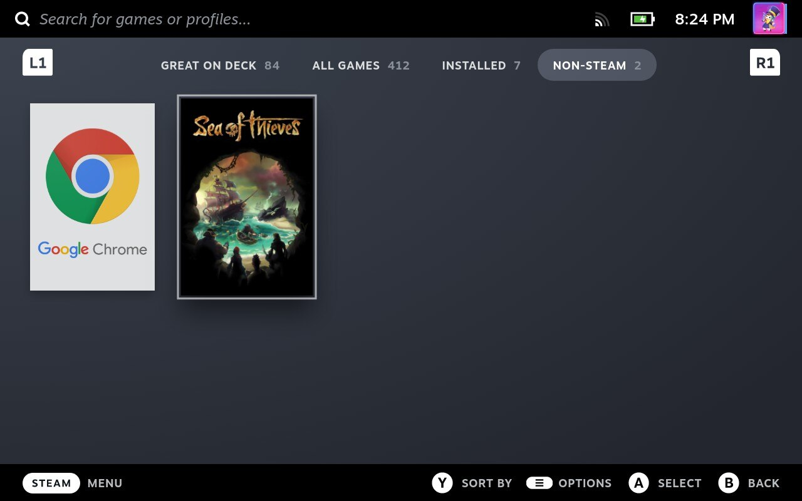
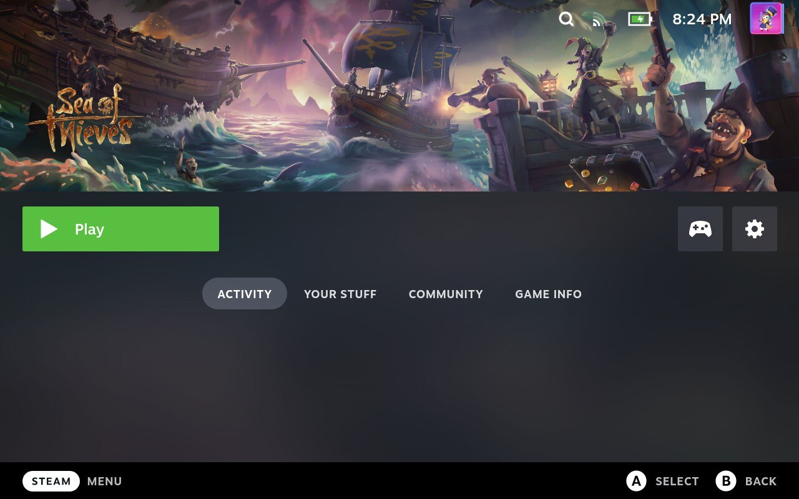
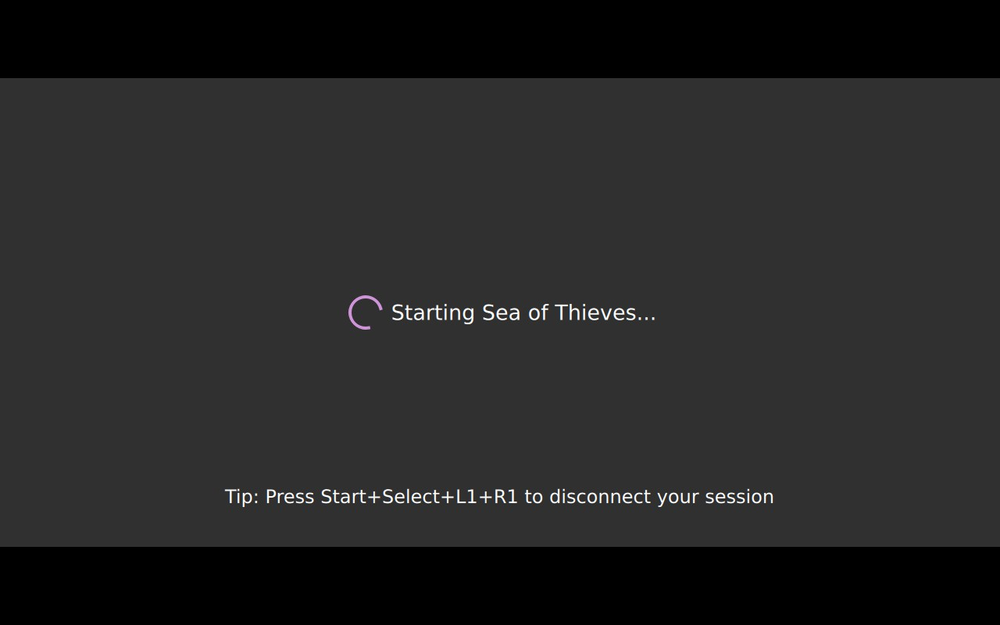
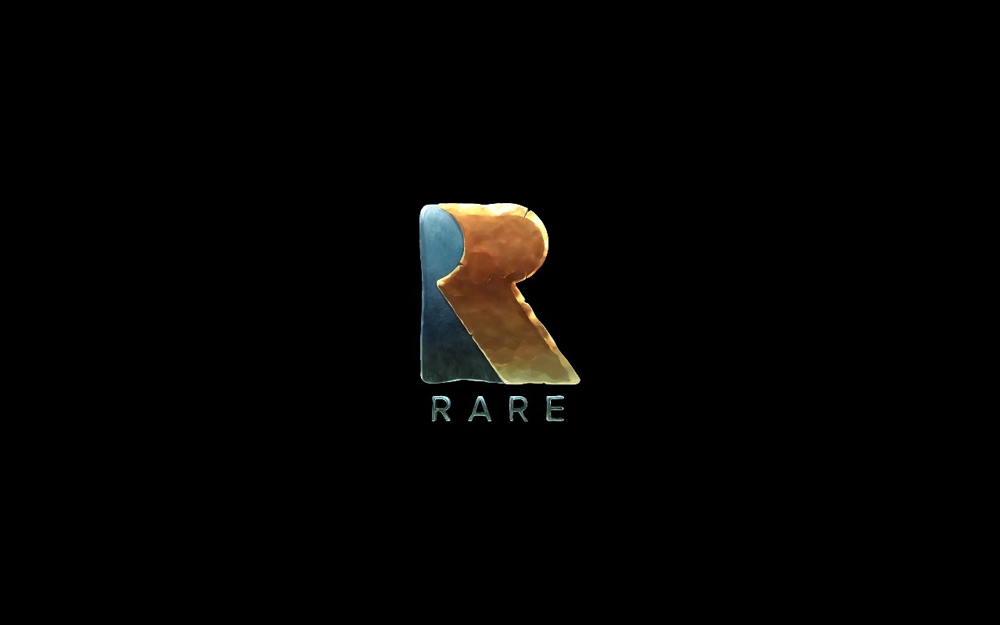

# Integrate Moonlight with Steam Deck UI

## What is a Steam Deck?

> The Steam Deck is a handheld gaming computer developed by Valve [^1]

https://store.steampowered.com/steamdeck

## What is Moonlight?

> Moonlight (formerly Limelight) is an open source implementation of NVIDIA's GameStream protocol.

https://moonlight-stream.org/

In short: It allows a machine (in this instance, a Steam Deck) to stream games from another machine using Nvidia custom sauce.

## What is the goal here?

To have a seamless experience between launching a game through Moonlight and to stream a game with Steam Remote Play.

## But why?

- Non-Steam games, especially UWP (looking at you GamePass users) are a pain to setup with Steam Remote Play.
- Users on /r/SteamDeck and /r/Steam boast better perfs with Moonlight.
- Individual game settings

## End result

### YouTube demo:

_Click to go to YouTube_

### Galery

_Games individually listed in the non-steam games section_

_Game images from SteamGridDB_

Press play and then... 

_Moonlight starting automatically the game on the Host Machine..._

_And the game, ready to play!_

## Prerequisites:
 - Have a Steam Deck
 - Have another computer, with a recent Nvidia graphic card (later refed as Host Machine)
 - Ensure your Host Machine is setup to GameStream. See [Moonlight Setup Guide](https://github.com/moonlight-stream/moonlight-docs/wiki/Setup-Guide#quick-setup-instructions)

## Setup steps

### Installing Moonlight

The Steam Deck ship with Flatpak as its package manager, you can use it directly, or use Discover.
If you use Discover, wait for Discover to find all the packages, it'll take a while. Then look for Moonlight from "Moonlight Game Streaming Team" and install it.

If you're used to using a package manager through the terminal, by all means, do so. (won't hold your hands)

### Testing Moonlight

Before going throught the hoops to set it up with Steam, let's try it out.
- Ensure your Host Machine and Steam Deck are connected on the same local network.
- Start Moonlight
- You should see your Host Machine listed in. Take note of its name, you'll need it.
> If your Host Machine is not listed, refer to [Moonlight Troubleshooting Guide](https://github.com/moonlight-stream/moonlight-docs/wiki/Troubleshooting).
- Select your Host Machine.
- You should have a pairing code prompt on your Host Machine, and a code displayed on your Steam Deck. You know what to do.
- Try to launch a game.
- Ensure that your control are passed thru properly.
  - If not, back on the Moonlight, click the cog up right to access the settings of Moonlight.
  - Check "Force gamepad #1 always connected".

All's working? Good, now, let's set up a 'moonlighted' game in Steam

### Setting up a Moonlighted game

#### Adding a Moonlight shortcut
Technical explanation:
>We're about to set a steam app to launch moonlight cli with some arguments that will allow moonlight to start the game directly.

Steps:

- From the desktop experience, start Steam and goto 'Add a non-steam game' (click Add a game and select the option).
- Select any app, as we will be setting the target and start directory manually afterward.
- Click on Add Select Programs
- In your Steam library, left-click the shortcut you just added and select properties.
- A window should open with several fields. First we want to set `Target` and `Start In` to `"/var/lib/flatpak/app/com.moonlight_stream.Moonlight/current/active/export/bin/com.moonlight_stream.Moonlight"`

From here, you could close the window and launch Moonlight from Steam. But that's not our end goal.

#### Parametrizing the Moonlight Shortcut

- While on the properties windows, set the launch options: `stream $HOST_MACHINE_NAME "Game of your Name"`.
> So, for example, if my host machine name is GLAD0S and I want to play Portal 2 I should put `stream GLAD0S "Portal 2"`
- Change the name of the shortcut to the name of your game (I mean, I'd do that if I were you.)

From here, your game is playable directly from the Steam Deck experience. However, it's pretty bland. No pictures, nothing. Pretty dull, innit?

#### Customizing the Game Shortcut

To customize your new shortcut, we'll use [SteamGridDb](https://www.steamgriddb.com).

- Create an account/Login
- Install [SGDBoop](https://www.steamgriddb.com/boop) (Flatpak is the option you are looking for)
- On the install page, press dat boop button!
- Restart your Steam Deck, go back to the Desktop.
- Look for your game on SteamGridDb and pick the assets you want to use.
- For each asset type (grids, heroes, icons, logos) do the following step:
  - Hover it and click on the Boop button with a + icon "Apply with BOOP (non-steam)"
  - Chrome will prompt you with a pop-up, click on "Open xdg-open" [^2]
  - That will open an app on your Deck, select the Game you created, and click OK.
  > If nothing happens, try the troubleshooting steps of [SGDBoop](https://www.steamgriddb.com/boop).
  > Notably, try running `systemctl restart --user xdg-desktop-portal`.[^3]
- Profit!

And that's all, your game is set up, you can go back to your deck. :tada:

And yes, rinse and repeat for every other game.

[^1]: https://en.wikipedia.org/wiki/Steam_Deck
[^2]: Security/tech explanation: This uses `xdg-open` and  the `sgdb` custom url scheme that BOOP registered on install to launch BOOP with some params to launch BOOP.
